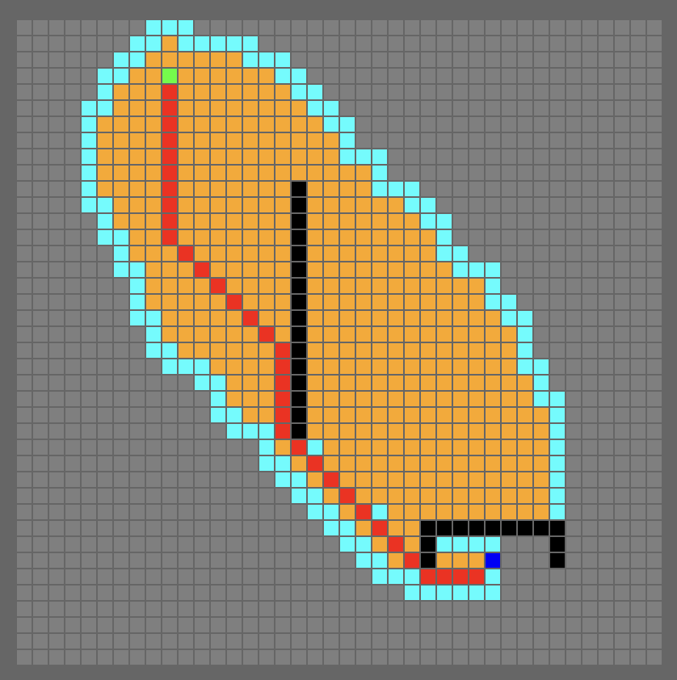

A first play with Bevy.

A* path finder.

## Controls
- `Left Click` set start locations (Green)
- `Right Click` set target location (Blue)
- `S` find the path (Path = Red, Closed set = Orange, Open set = Light Blue)
- `R` reset
- `Shift + Left Click` add / remove obstacles (Black)

